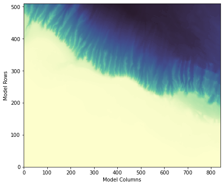

Alaska Slope Regional Model
***************************

.. _alaska_overview:

Overview
========
This is a description of the AK model

The construction of this model showcases many of the components of the eccoseas
package in the downscale and ecco modules.

This model example will showcase the following updates not previously shown in the previous model examples:

1. Constructing pickup files for regional models given pickups from global models
2. Working with passive tracers (used for biogeochemical packages)

The functions used in this demo include the tasks in the following list:

1. Reading and writing pickup files
2. Interpolating 2D and 3D grids to regional domains

Required ECCO Data
^^^^^^^^^^^^^^^^^^

The initial conditions for this model will be generating using existing pickup files from the ECCO-Darwin solution. The list of 
pertainent files is listed here:

.. list-table:: ECCO-Darwin files required to construct the Alaska North Slope regional model
   :widths: 50 50 
   :header-rows: 1

   * - Description
     - File(s)
   * - Physical Variables Pickup
     - pickup.0000000001.data, pickup.0000000001.meta
   * - Seaice Variables Pickup
     - pickup_seaice.0000000001.data, pickup_seaice.0000000001.meta
   * - Darwin Variable Pickup (pH)
     - pickup_darwin.0000000001.data, pickup_darwin.0000000001.meta
   * - Darwin Tracers Pickup
     - pickup_ptracers.0000000001.data, pickup_ptracers.0000000001.meta

In addition to the data above, we also need the grid information.
We read this in from the `nctiles_grid <https://ecco.jpl.nasa.gov/drive/files/Version5/Alpha/nctiles_grid>`_ section of the ECCO Drive:

.. list-table:: ECCO grid files required to construct the Alaska North Slope regional model
   :widths: 50 50 
   :header-rows: 1

   * - Description
     - File(s)
   * - Grid description
     - tile001.mitgrid, tile002.mitgrid, tile003.mitgrid, tile004.mitgrid, tile005.mitgrid
   * - Grid angles
     - AngleCS.data, - AngleSN.data
   * - Grid wet masks
     - hFacC.data, hFacS.data, hFacW.data

Model Grid
==========

.. toctree::

   model_grid

Interpolation Grid
==================

.. toctree::

   interpolation_grid

Initial Conditions
===========================

.. toctree::

   initial_conditions
