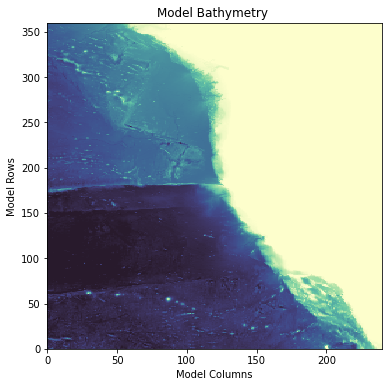

California Regional Model
*************************

Overview
========
The regional model is constructed in the eastern Pacific Ocean and encompasses most of the 
California current region. This model is constructed to run during the year 2008 and 
is initiated and forced with output from the ECCO Version 5 Alpha State Estimate. The 
domain of the regional model is shown in the following plot:

eccoseas modules
^^^^^^^^^^^^^^^^

The construction of this model showcases many of the components of the **eccoseas**
package in the *downscale* and *ecco* modules. These modules are used in this demo
to complete the following list of tasks:

1. Bathymetry "filling" to remove isolated regions
2. Reading the ECCO grid
3. Reading ECCO Version 5 output fields
4. Reading ECCO external forcing fields
5. Interpolating 2D and 3D fields to a regional domain for initial, external, and boundary conditions

Required ECCO Data
^^^^^^^^^^^^^^^^^^
For this example, the following list of files are required from the ECCO Version 5 Alpha State estimate. These
files are available on the `ECCO drive <https://ecco.jpl.nasa.gov/drive/>`_.

.. list-table:: ECCO files required to construct the California regional model
   :widths: 50 50
   :header-rows: 1

   * - Variable
     - File(s)
   * - Potential Temperature
     - THETA_2007.nc, THETA_2008.nc, THETA_2009.nc
   * - Salinity
     - SALT_2007.nc, SALT_2008.nc, SALT_2009.nc
   * - u-Component of Velocity
     - UVELMASS_2007.nc, UVELMASS_2008.nc, UVELMASS_2009.nc
   * - v-Component of Velocity
     - VVELMASS_2007.nc, VVELMASS_2008.nc, VVELMASS_2009.nc
   * - Sea Surface Height Anomaly
     - ETAN_2007.nc, ETAN_2008.nc, ETAN_2009.nc
   * - Lowngwave Downwelling Radiation
     - EIG_dlw_plus_ECCO_v4r1_ctrl_2008
   * - Shortwave Downwelling Radiation
     - EIG_dsw_plus_ECCO_v4r1_ctrl_2008
   * - u-Component of Wind
     - EIG_u10m_2008
   * - v-Component of Wind
     - EIG_v10m_2008
   * - Precipitation
     - EIG_rain_plus_ECCO_v4r1_ctrl_2008
   * - Air Temperature
     - EIG_tmp2m_degC_plus_ECCO_v4r1_ctrl_2008
   * - Specific Humidity
     - EIG_spfh2m_plus_ECCO_v4r1_ctrl_2008  
   * - Grid components for each tile
     - GRID.0001.nc through GRID.0013.nc

Configuration Files
^^^^^^^^^^^^^^^^^^^
The model configuration files for this regional model are provided in the configurations directory
of the **eccoseas** Github repository.

The following sections showcase the construction of the input binaries for the model.

Model Grid
==========

.. toctree::

   model_grid

Bathymetry
==========

.. toctree::

   bathymetry

Initial Conditions
===========================

.. toctree::

   initial_conditions

External Forcing Conditions
===========================

.. toctree::

   external_conditions

Boundary Conditions
===========================

.. toctree::

   boundary_conditions
