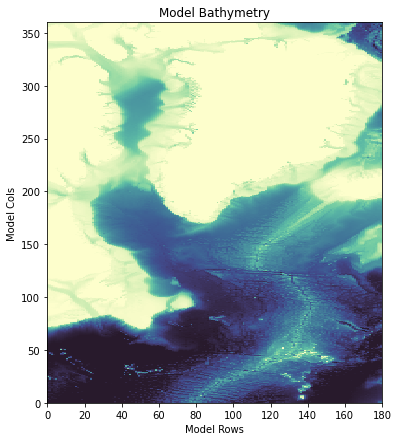

North Atlantic Regional Model
*****************************

Overview
========
This regional model is constructed in the North Atlantic Ocean and encompasses the North 
Atlantic current and the ocean around the Greenland Ice Sheet. This model is constructed to run during the 
entirety of the time period covered by the publicly-available output from the  ECCO Version 5 Alpha State
Estimate i.e. 1992 through 2017. The domain of the regional model is shown in the following plot:

The domain of the regional model is shown in the following plot:

As we can see in this domain, this model is build on a curvilinear grid rather than a regular
rectangular grid. As a result, vector quanties such as water velocity need to be interpolated onto
the curvilinear grid rather than provided in zonal and meridional directions. Further, this region
of the ocean has sea ice.

The construction of this model showcases additional components of the **eccoseas**
package in the *downscale* and *ecco* modules pertaining to vector rotations
and working with sea ice variables.

Required ECCO Data
^^^^^^^^^^^^^^^^^^

For this example, the following list of files are required from the ECCO Version 5 Alpha State estimate. These
files are available on the `ECCO drive <https://ecco.jpl.nasa.gov/drive/>`_.

.. list-table:: ECCO files required to construct the North Atlantic regional model
   :widths: 50 50
   :header-rows: 1

   * - Variable
     - File(s)
   * - Potential Temperature
     - THETA_1992.nc to THETA_2017.nc
   * - Salinity
     - SALT_1992.nc to SALT_2017.nc
   * - u-Component of Velocity
     - UVELMASS_2017.nc to UVELMASS_2017.nc
   * - v-Component of Velocity
     - VVELMASS_2007.nc to VVELMASS_2017.nc
   * - Sea Surface Height Anomaly
     - ETAN_1992.nc
   * - Sea ice concentration
     - SIarea_1992.nc
   * - Sea ice effective thickness
     - SIheff_1992.nc
   * - Snow thickness on sea ice
     - SIhsnow_1992.nc
   * - u-Component of sea ice velocity
     - SIuice_1992.nc
   * - v-Component of sea ice velocity
     - SIvice_1992.nc
   * - Lowngwave Downwelling Radiation
     - EIG_dlw_plus_ECCO_v4r1_ctrl (1992-2017)
   * - Shortwave Downwelling Radiation
     - EIG_dsw_plus_ECCO_v4r1_ctrl (1992-2017)
   * - u-Component of Wind
     - EIG_u10m (1992-2017)
   * - v-Component of Wind
     - EIG_v10m (1992-2017)
   * - Precipitation
     - EIG_rain_plus_ECCO_v4r1_ctrl (1992-2017)
   * - Air Temperature
     - EIG_tmp2m_degC_plus_ECCO_v4r1_ctrl (1992-2017)
   * - Specific Humidity
     - EIG_spfh2m_plus_ECCO_v4r1_ctrl (1992-2017)  
   * - Grid components for each tile
     - GRID.0001.nc through GRID.0013.nc

Initial Conditions
==================

.. toctree::

   initial_conditions

Boundary Conditions
===================

.. toctree::

   boundary_conditions
